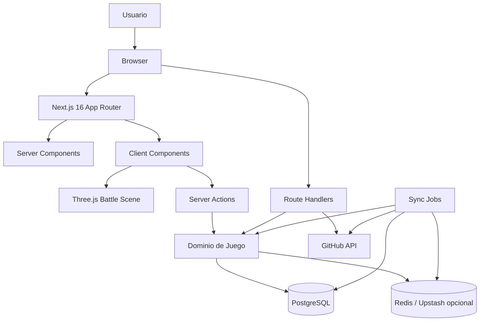
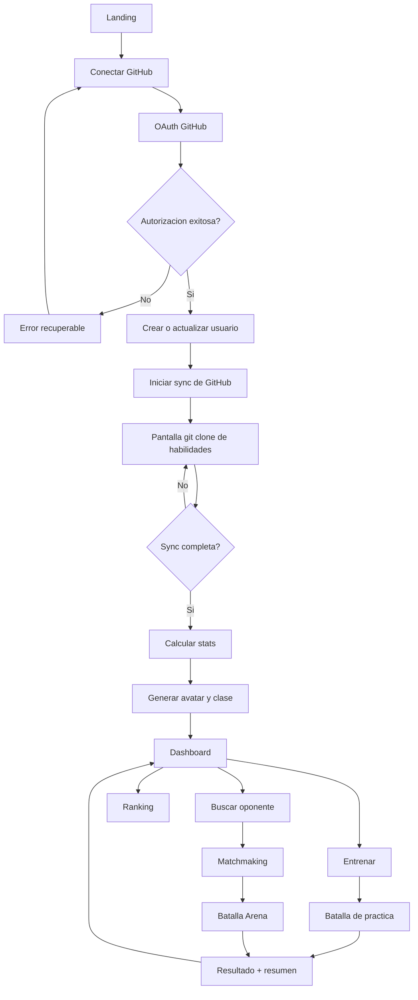
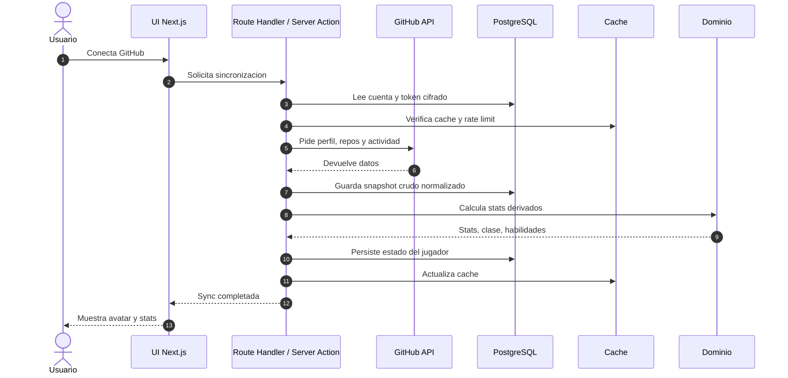
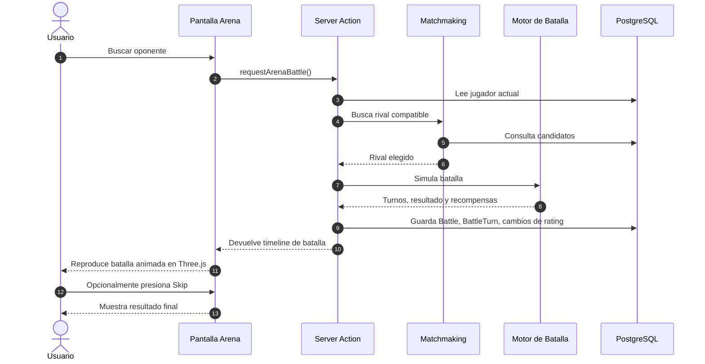
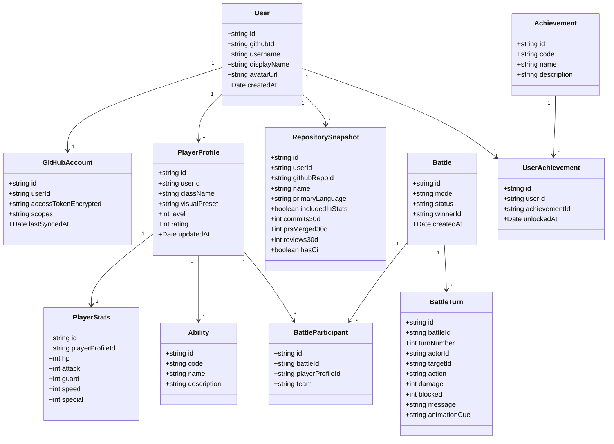
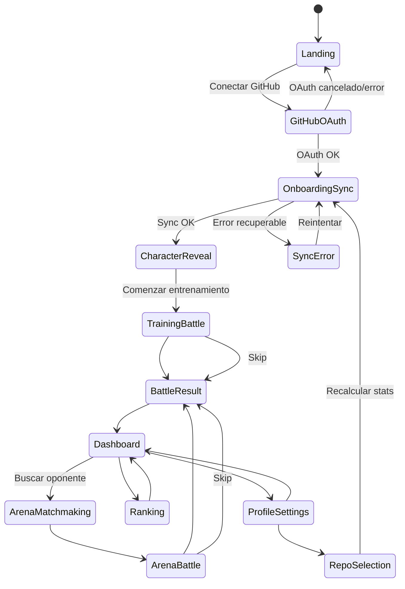
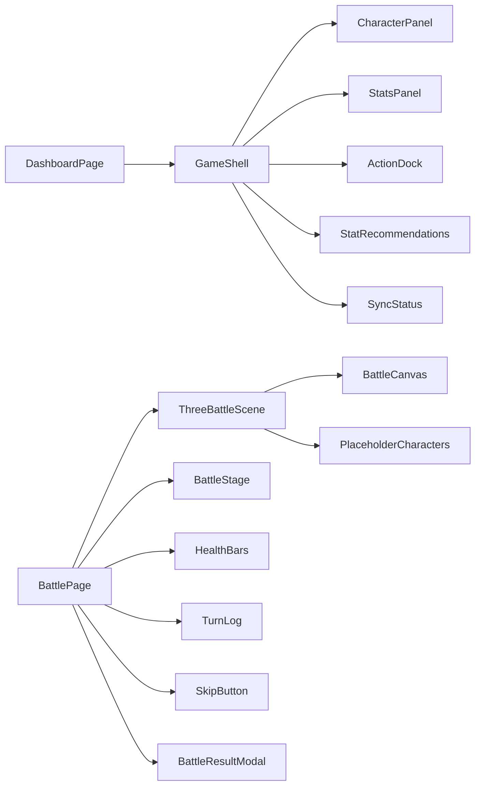

# Arquitectura Propuesta: Battle Git

## 1. Objetivo del Documento

Este documento propone una arquitectura inicial para Battle Git usando Next.js 16 con App Router. La intencion es definir una base tecnica clara para el MVP: autenticacion con GitHub, sincronizacion de datos, calculo de stats, generacion de personaje, batalla, rankings e historial.

La arquitectura prioriza:

- MVP rapido sin separar prematuramente frontend y backend.
- Reglas de dominio testeables fuera de la UI.
- Sincronizacion resiliente ante rate limits de GitHub.
- Privacidad y control de datos desde el inicio.
- Capacidad de evolucionar hacia jobs, colas y servicios separados.

## 2. Stack Tecnico Propuesto

- Framework: Next.js 16 App Router.
- Lenguaje: TypeScript.
- UI: React, Tailwind CSS.
- Escenas, personajes y animaciones de batalla: Three.js.
- Animaciones de UI: Framer Motion.
- Auth: Clerk con GitHub OAuth.
- Base de datos: PostgreSQL.
- ORM: Drizzle.
- Cache y rate limiting: Redis/Upstash cuando aparezca una necesidad real.
- Jobs asincronicos: Vercel Cron + cola ligera, o worker separado en una fase posterior.
- Deploy: Vercel.
- Testing: Vitest para dominio, Playwright para flujos principales.

## 3. Vista General de Arquitectura



## 4. Capas de la Aplicacion

### 4.1 Presentacion

Ubicacion sugerida:

- `app/`
- `components/`
- `components/battle-scene/`

Responsabilidades:

- Renderizar pantallas con App Router.
- Mantener interacciones visuales de batalla.
- Renderizar escenarios, personajes y efectos con Three.js.
- Consumir Server Actions o Route Handlers.
- Mostrar estados de carga, error y sincronizacion.

Notas para Three.js:

- Los componentes Three.js deben vivir del lado cliente.
- La simulacion de batalla debe venir resuelta desde el dominio; Three.js solo reproduce el timeline.
- En MVP se usaran placeholders geometricos con colores por clase/personaje.
- Los assets finales seran propios y se integraran cuando esten disponibles.

### 4.2 Aplicacion

Ubicacion sugerida:

- `features/`
- `server/actions/`
- `server/queries/`

Responsabilidades:

- Orquestar casos de uso.
- Validar permisos del usuario.
- Decidir cuando leer cache, base de datos o GitHub.
- Traducir eventos de UI en operaciones del dominio.

Ejemplos:

- `syncGitHubProfile(userId)`
- `calculatePlayerStats(userId)`
- `startTrainingBattle(userId)`
- `findArenaOpponent(userId)`
- `claimAchievement(userId, achievementId)`

### 4.3 Dominio

Ubicacion sugerida:

- `domain/`

Responsabilidades:

- Reglas de stats.
- Reglas de batalla.
- Matchmaking.
- Logros.
- Normalizacion anti-abuso.

Esta capa no deberia depender de React, Next.js ni de la base de datos directamente.

### 4.4 Infraestructura

Ubicacion sugerida:

- `server/db/`
- `server/github/`
- `server/cache/`
- `server/jobs/`

Responsabilidades:

- Cliente de GitHub.
- Acceso a base de datos.
- Cache.
- Jobs programados.
- Adaptadores externos.

## 5. Diagrama de Flujo Principal



## 6. Flujo de Sincronizacion con GitHub



## 7. Flujo de Batalla



Decision de MVP:

- La batalla se simula server-side.
- La UI recibe un timeline reproducible.
- El usuario puede mirar la animacion o saltarla con "Skip".
- Las acciones elegidas por usuario quedan para una fase futura.
- `/game/arena/battle` reutiliza el playback visual de batalla para combates contra usuarios o bots starter.
- Los bots starter se generan en servidor como combatientes virtuales, no como filas reales en `users`.
- La arena mezcla combatientes reales con bots identificados como `BOT`, escalados segun el poder actual del usuario.

## 8. Modelo de Dominio Inicial



## 9. Interaccion de Pantallas



## 10. Mapa de Rutas App Router

Propuesta inicial:

```text
app/
  (marketing)/
    page.tsx                         # Landing
  (auth)/
    login/page.tsx                   # Entrada alternativa a OAuth
    callback/page.tsx                # Callback si el proveedor lo requiere
  (game)/
    layout.tsx                       # Shell autenticado
    dashboard/page.tsx               # Panel principal
    onboarding/sync/page.tsx         # git clone de habilidades
    onboarding/reveal/page.tsx       # Avatar y stats iniciales
    battle/training/page.tsx         # Batalla de practica
    battle/arena/page.tsx            # Arena PvP
    battle/[battleId]/page.tsx       # Replay / resultado
    rankings/page.tsx                # Rankings
    profile/page.tsx                 # Perfil publico/privado
    settings/page.tsx                # Privacidad y repos
  api/
    clerk/webhooks/route.ts          # Webhooks de Clerk si se necesitan
    github/sync/route.ts             # Sync manual o webhook interno
    jobs/sync/route.ts               # Endpoint protegido para cron
```

## 11. Componentes de UI Principales



## 12. Servicios de Dominio

### GitHub Sync Service

Responsabilidades:

- Obtener perfil, repositorios y actividad.
- Respetar rate limits.
- Guardar snapshots normalizados.
- Leer el army desde `repository_snapshots` en Neon por defecto, sin consultar GitHub en cada render.
- Permitir sync manual como maximo una vez por dia por usuario.
- Registrar cada intento en `sync_runs` con estado, error y cantidad de repos procesados.
- Detectar repos excluidos por el usuario.

### Stats Engine

Responsabilidades:

- Convertir actividad en stats.
- Aplicar normalizacion y limites.
- Generar explicaciones de stats.
- Separar senales reales de senales proxy.

### Character Engine

Responsabilidades:

- Determinar clase principal.
- Seleccionar habilidades.
- Resolver cosmeticos desbloqueados.
- Asignar un `visualPreset` para placeholders y futuros assets propios.
- Mapear lenguaje/clase a color, silueta y estilo visual inicial.

### Battle Engine

Responsabilidades:

- Simular turnos.
- Aplicar habilidades.
- Calcular dano, defensa y variacion.
- Emitir un timeline reproducible por UI.
- Emitir cues de animacion para que Three.js reproduzca ataques, bloqueos, impactos y estados.

### Matchmaking Service

Responsabilidades:

- Buscar rivales por rating y poder relativo.
- Evitar emparejamientos repetitivos.
- Separar entrenamiento de PvP competitivo.

### Achievement Service

Responsabilidades:

- Evaluar logros luego de sync o batalla.
- Evitar logros que incentiven abuso.
- Emitir recompensas cosmeticas.

## 13. Contratos de Datos Internos

### Stats calculados

```ts
type PlayerStats = {
  hp: number;
  attack: number;
  guard: number;
  speed: number;
  special: number;
  powerScore: number;
  explanations: StatExplanation[];
};

type StatExplanation = {
  stat: "hp" | "attack" | "guard" | "speed" | "special";
  label: string;
  value: number;
  source: "commits" | "prs" | "reviews" | "issues" | "ci" | "streak" | "language";
};
```

### Resultado de batalla

```ts
type BattleSimulation = {
  battleId: string;
  mode: "training" | "arena" | "raid";
  participants: BattleParticipantView[];
  turns: BattleTurnView[];
  winnerId: string | null;
  rewards: BattleReward[];
};

type BattleTurnView = {
  turn: number;
  actorId: string;
  targetId: string;
  action: string;
  damage: number;
  blocked: number;
  message: string;
  animationCue: "attack" | "block" | "special" | "hit" | "defeat";
};
```

### Preset visual de personaje

```ts
type CharacterVisualPreset = {
  className: string;
  primaryColor: string;
  secondaryColor: string;
  placeholderShape: "cube" | "capsule" | "prism" | "orb";
  futureAssetKey?: string;
};
```

### Personaje de repositorio

```ts
type RepositoryCharacter = {
  id: number;
  name: string;
  language: string;
  kind: "Mago" | "Caballero" | "Arquero" | "Guardian" | "Paladin" | "Berserker" | "Explorador" | "Esbirro";
  power: number;
  commits: number;
  forks: number;
  issues: number;
  isFork: boolean;
  color: string;
  url: string;
};
```

Los repositorios publicos de GitHub se transforman en personajes para el campo de batalla. Los forks siempre se degradan a `Esbirro`; los repos source toman clase segun lenguaje principal. El canvas Three.js debe permitir exploracion con WASD/flechas y zoom.

Decision de datos para MVP:

- La ruta autenticada `/game/army` lee personajes desde Neon.
- GitHub solo se consulta cuando el usuario dispara un sync permitido.
- El sync diario reemplaza el snapshot de repositorios del usuario y deja auditoria en `sync_runs`.
- La escena Three.js debe exponer tooltip al hover con nombre, Fork/Source, tipo y poder.

## 14. Persistencia Propuesta

Tablas iniciales:

- `users`
- `github_accounts`
- `repository_snapshots`
- `player_profiles`
- `player_stats`
- `abilities`
- `player_abilities`
- `battles`
- `battle_participants`
- `battle_turns`
- `achievements`
- `user_achievements`
- `ranking_entries`
- `sync_runs`

Campos visuales iniciales:

- `player_profiles.visual_preset`: identifica color, forma placeholder y futuro asset del personaje.
- `battle_turns.animation_cue`: permite reproducir el timeline en Three.js sin recalcular la batalla en cliente.

Tabla importante para auditoria:

- `sync_runs`: guarda estado, fecha, errores, duracion, rate limit restante y cantidad de repos procesados.

## 15. Seguridad y Privacidad

- Cifrar tokens de GitHub en reposo.
- Solicitar el minimo scope posible para MVP.
- Usar solo repositorios publicos en MVP.
- No mostrar datos sensibles en perfiles publicos.
- Permitir desconectar GitHub y borrar datos sincronizados.
- Permitir excluir repositorios antes de recalcular stats.
- Separar datos crudos de GitHub de stats publicables.
- Proteger endpoints de jobs con secret server-side.

## 16. Estrategia Anti-Abuso

Reglas iniciales:

- Ignorar commits generados por bots conocidos.
- Aplicar rendimiento decreciente a volumen de commits.
- Ponderar PRs mergeados y reviews por encima de commits aislados.
- Limitar beneficios por actividad nocturna.
- Detectar picos anormales y marcarlos para menor ponderacion.
- Usar ventanas temporales para evitar que un historial antiguo domine el ranking.

## 17. Observabilidad

Eventos a registrar:

- `github_sync_started`
- `github_sync_completed`
- `github_sync_failed`
- `stats_calculated`
- `battle_started`
- `battle_completed`
- `achievement_unlocked`
- `repo_excluded`

Metricas relevantes:

- Tiempo promedio de sync.
- Errores por rate limit.
- Conversion de landing a OAuth.
- Conversion de OAuth a primera batalla.
- Retencion semanal.
- Cantidad de batallas por usuario activo.

## 18. Plan de Implementacion Sugerido

### Fase 1: Fundacion

- Crear app Next.js 16.
- Configurar TypeScript, Tailwind, linting y testing.
- Configurar Clerk con GitHub OAuth.
- Configurar Drizzle y esquema inicial de base de datos.

### Fase 2: Sync y Stats

- Implementar cliente GitHub.
- Guardar snapshots.
- Calcular stats iniciales.
- Mostrar pantalla de sync y dashboard.

### Fase 3: Personaje y Batalla

- Generar clase/avatar por lenguaje.
- Implementar motor de batalla deterministico con variacion controlada.
- Crear batalla de entrenamiento.
- Crear escena Three.js con placeholders geometricos por clase/personaje.
- Agregar boton "Skip" para saltar animaciones.
- Persistir resultado y timeline.

### Fase 4: Arena y Ranking

- Implementar matchmaking simple.
- Crear batalla Arena asincronica.
- Agregar ranking semanal.
- Agregar historial de batallas.

### Fase 5: Privacidad y Pulido

- Exclusion de repos.
- Explicabilidad de stats.
- Logros iniciales.
- Mejoras visuales y animaciones.
- Preparar integracion de assets propios.

## 19. Seguimiento Tecnico

- Redis/Upstash se incorpora solo cuando haya necesidad real, pero la arquitectura debe permitirlo sin reescrituras grandes.

### Caching en Next.js

Decision inicial:

- Usar cache nativo de Next.js en la capa de queries server-side antes de incorporar Redis/Upstash.
- Cachear lecturas derivadas de Neon por tags:
  - `army:{userId}` para snapshots de army.
  - `profile:{userId}` para perfil publico, poder, lenguajes e historial.
  - `arena:users` para el listado de usuarios de arena.
- Mantener Clerk y `currentUser()` fuera de funciones cacheadas.
- Invalidar tags al completar sync de GitHub o registrar una batalla.
- Usar un revalidate corto inicial de 5 minutos para reducir lecturas repetidas sin volver confusa la UI.

## 20. Decisiones Abiertas

- Las acciones elegidas por el usuario quedan como posible evolucion post-MVP.
- Falta definir el set inicial de presets visuales por clase/lenguaje.
- Falta definir como se modelaran equipos, requisitos de ingreso y paises en una fase futura.
- Falta definir cuanto peso tendran repos propios, forks y contribuciones a terceros.

## 21. Decisiones Tomadas

- Autenticacion con Clerk y GitHub OAuth.
- ORM con Drizzle.
- MVP con repositorios publicos solamente.
- Batallas simuladas server-side con timeline reproducible.
- UI de batalla con Three.js y boton "Skip".
- Assets propios a futuro; placeholders geometricos con colores por clase/personaje durante el MVP.
- Foco inicial en jugadores individuales.
- Equipos, requisitos de ingreso y representacion por paises quedan para una fase posterior.
